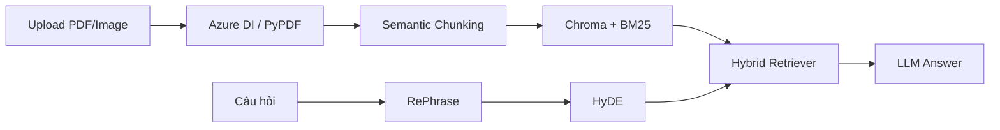

# 📄 DocSage – Vietnamese Document RAG Assistant

<p align="center">
  <strong>Ứng dụng AI hỏi đáp nội dung tài liệu bằng tiếng Việt</strong><br>
  Powered by RAG (Retrieval-Augmented Generation)
</p>

<p align="center">
  
  
  
  
</p>

---

## ✨ Tính năng

| Tính năng | Mô tả |
|---|---|
| 🔍 **Hybrid Retrieval** | Kết hợp Vector Search (Chroma) + BM25 để tối ưu truy xuất |
| 🧠 **RePhrase + HyDE** | Viết lại câu hỏi + tạo hypothetical answer trước khi retrieval |
| 📄 **Multi-format Parsing** | Hỗ trợ PDF, JPG, PNG, TIFF qua Azure Document Intelligence |
| 🤖 **Multi-LLM** | Chuyển đổi giữa Ollama (local) và OpenRouter (cloud) |
| 💬 **Chat History** | Giữ ngữ cảnh hội thoại qua các lượt hỏi |
| 🐳 **Docker Ready** | Dockerfile + Docker Compose cho deployment |

## 📁 Cấu trúc dự án

```
docsage/
├── app.py                      # Streamlit UI chính
├── requirements.txt            # Python dependencies
├── .env.example                # Template biến môi trường
├── Dockerfile                  # Container image
├── docker-compose.yml          # Multi-service orchestration
├── .dockerignore
├── .gitignore
├── core/
│   ├── __init__.py
│   ├── config.py               # Centralized configuration
│   ├── azure_doc_parser.py     # Azure DI + PyPDF parser
│   ├── document_loader.py      # Chunking + Retriever pipeline
│   ├── llm_manager.py          # Multi-provider LLM factory
│   └── rag_chains.py           # RAG chain (RePhrase → HyDE → Retrieve → Answer)
└── data/
    └── chroma_db/              # Vector database (auto-generated)
```

## 🚀 Cài đặt & Chạy

### Yêu cầu

- Python 3.10+
- [Ollama](https://ollama.ai) (nếu dùng local LLM)

### 1. Clone repository

```bash
git clone https://github.com/<username>/docsage.git
cd docsage
```

### 2. Tạo môi trường ảo

```bash
python -m venv .venv
source .venv/bin/activate      # Linux/Mac
# .venv\Scripts\activate       # Windows
```

### 3. Cài đặt dependencies

```bash
pip install -r requirements.txt
```

### 4. Cấu hình biến môi trường

```bash
cp .env.example .env
# Sửa .env với các giá trị thực tế
```

### 5. Pull Ollama models (nếu dùng local)

```bash
ollama pull qwen3.5:4b
ollama pull qwen3.5:2b-q4_K_M
```

### 6. Chạy ứng dụng

```bash
streamlit run app.py
```

Mở trình duyệt tại `http://localhost:8501`

## 🐳 Chạy với Docker

```bash
# Build & chạy
docker compose up --build

# Hoặc chạy đơn lẻ
docker build -t docsage .
docker run -p 8501:8501 --env-file .env docsage
```

## ⚙️ Cấu hình (.env)

```bash
# ── Azure Document Intelligence (optional) ───────────────────────
AZURE_DOC_INTEL_ENDPOINT=
AZURE_DOC_INTEL_KEY=

# ── LLM Provider: "ollama" | "openrouter" ───────────────────────
LLM_PROVIDER=ollama

# ── OpenRouter (cloud LLM) ──────────────────────────────────────
# Theo docs ChatOpenRouter: OPENROUTER_API_BASE
OPENROUTER_API_BASE=https://openrouter.ai/api/v1
OPENROUTER_API_KEY=
OPENROUTER_MODEL=openrouter/auto
OPENROUTER_FAST_MODEL=openrouter/auto

# ── Ollama (local LLM) ──────────────────────────────────────────
OLLAMA_BASE_URL=                    # Để trống = auto-detect
OLLAMA_MODEL=qwen3.5:4b
OLLAMA_FAST_MODEL=qwen3.5:2b-q4_K_M
```

> **💡 OpenRouter:** Dùng API key từ OpenRouter, đặt `LLM_PROVIDER=openrouter` và cấu hình model phù hợp theo nhu cầu.

## 🔄 Luồng xử lý



1. **Document Parsing** – Azure DI (OCR + layout) hoặc PyPDF (fallback)
2. **Chunking** – SemanticChunker chia theo ngữ nghĩa
3. **Indexing** – Chroma vector DB + BM25 keyword index
4. **Query** – RePhrase viết lại câu hỏi → HyDE tạo hypothetical answer
5. **Retrieval** – Hybrid search (60% vector + 40% BM25)
6. **Answer** – LLM tổng hợp câu trả lời từ ngữ cảnh tài liệu

## 🛠️ Tech Stack

| Component | Technology |
|---|---|
| **Frontend** | Streamlit |
| **Embedding** | `bkai-foundation-models/vietnamese-bi-encoder` |
| **Vector DB** | ChromaDB |
| **LLM (local)** | Ollama (Qwen 3.5) |
| **LLM (cloud)** | OpenRouter |
| **Document Parser** | Azure Document Intelligence + PyPDF |
| **Framework** | LangChain |

## 🐛 Troubleshooting

| Vấn đề | Giải pháp |
|---|---|
| Lỗi kết nối Ollama | Kiểm tra `ollama serve` đang chạy, `ollama list` có model |
| Trả lời không bám tài liệu | Thử PDF text-based, hỏi cụ thể hơn |
| Azure DI không hoạt động | Kiểm tra endpoint + key trong `.env` |
| OpenRouter lỗi 401 | Kiểm tra API key, đảm bảo `OPENROUTER_API_BASE` đúng |
| Dependency lỗi | `pip install -U pip && pip install -r requirements.txt` |

## 📝 License

MIT License

---

<p align="center">
  Made with ❤️ for Vietnamese AI community
</p>
